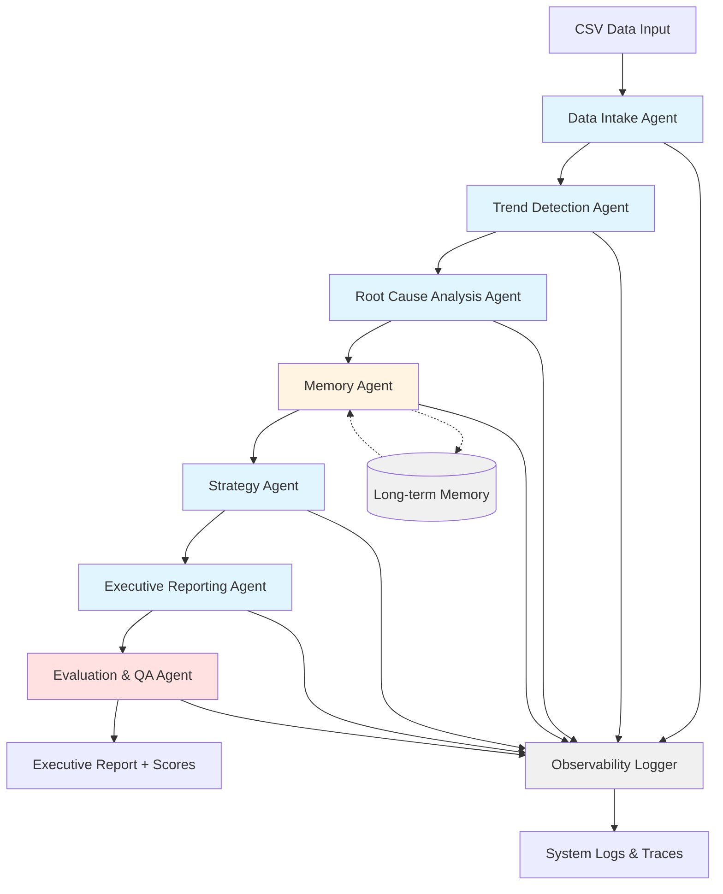

# AUTOOPS AI — Multi-Agent System for Business Intelligence

**A Production-Ready Multi-Agent Enterprise AI System**

Transform raw business data into executive decisions through intelligent agent orchestration.

---

## 🎯 Problem Statement

Business executives need to make data-driven decisions quickly, but analyzing raw data, identifying trends, understanding root causes, and formulating strategies is time-consuming and requires specialized expertise. Traditional BI tools provide dashboards but lack the intelligence to automatically:

- Detect anomalies and trends
- Perform root cause analysis
- Generate strategic recommendations
- Learn from historical patterns
- Evaluate the quality of insights

**AUTOOPS AI** solves this by deploying a multi-agent system where specialized AI agents collaborate to transform raw CSV data into actionable executive reports with strategic recommendations.

---

## 🤖 Why Multi-Agent Architecture?

A multi-agent approach is superior to a monolithic system because:

1. **Specialization**: Each agent focuses on a specific task (data cleaning, trend detection, strategy generation), leading to higher quality outputs
2. **Modularity**: Agents can be updated, replaced, or improved independently
3. **Scalability**: New agents can be added without disrupting existing ones
4. **Observability**: Each agent's actions are logged separately, making debugging and optimization easier
5. **Parallel Potential**: While currently sequential, the architecture supports parallel execution where appropriate
6. **Maintainability**: Smaller, focused codebases are easier to test and maintain

---

## 🏗️ System Architecture



### Sequential Pipeline

The system executes agents in a carefully designed sequence:

1. **Data Intake** → Validates and cleans data
2. **Trend Detection** → Identifies patterns and anomalies
3. **Root Cause Analysis** → Explains why trends occurred
4. **Memory** → Stores insights and compares with history
5. **Strategy** → Generates recommendations and forecasts
6. **Reporting** → Synthesizes everything into executive report
7. **Evaluation** → Scores quality and provides feedback

---

## 🤖 Agent Responsibilities

### 1. Data Intake Agent
**Role**: Data Quality Guardian

- Loads CSV files using pandas
- Validates schema against required columns
- Cleans data (handles nulls, removes duplicates)
- Assesses data quality (completeness score)
- Outputs: Clean DataFrame + quality report

### 2. Trend Detection Agent
**Role**: Pattern Recognizer

- Analyzes KPI trends (Revenue, Customers, Conversion Rate, Marketing Spend)
- Calculates growth rates and moving averages
- Detects anomalies using z-score method
- Identifies top 3 most significant trends
- Outputs: Trend analysis + anomaly report

### 3. Root Cause Analysis Agent
**Role**: Investigative Analyst

- Calculates correlation matrix between KPIs
- Identifies drivers of change (strong correlations)
- Generates hypotheses about causal relationships
- Analyzes performance by channel
- Outputs: Correlation insights + hypotheses

### 4. Memory Agent
**Role**: Organizational Memory

- Stores session data in JSON
- Maintains KPI snapshots for each date
- Compares current KPIs with 30-day historical average
- Enables learning from past analyses
- Outputs: Historical comparison + memory stats

### 5. Strategy Agent
**Role**: Strategic Advisor

- Generates prioritized business recommendations
- Creates detailed action plans with success metrics
- Identifies risks (declining trends, high volatility)
- Spots opportunities (strong growth, best channels)
- Produces forecasts (7-day and 30-day projections)
- Outputs: Recommendations + action plans + forecast

### 6. Executive Reporting Agent
**Role**: Communication Specialist

- Synthesizes insights from all agents
- Generates professional markdown report
- Includes: KPI summary, trends, root causes, recommendations, risks, opportunities, forecast
- Formats for executive consumption
- Outputs: Comprehensive executive report

### 7. Evaluation & QA Agent
**Role**: Quality Assurance

- Scores report clarity (0-10)
- Evaluates logical consistency (0-10)
- Assesses actionability (0-10)
- Calculates overall quality score
- Determines confidence score
- Identifies strengths and weaknesses
- Provides improvement suggestions
- Outputs: Quality scores + feedback

---

## 🛠️ Tool Design

### CSV Tools (`csv_tools.py`)
- **Purpose**: Data loading and quality assessment
- **Key Functions**:
  - `load_csv()`: Load CSV with metadata
  - `validate_schema()`: Check required columns
  - `clean_data()`: Handle nulls and duplicates
  - `get_data_quality_score()`: Calculate completeness

### Statistical Tools (`stats_tools.py`)
- **Purpose**: Advanced analytics and pattern detection
- **Key Functions**:
  - `calculate_basic_stats()`: Mean, median, std dev, quartiles
  - `detect_trend()`: Moving averages, growth rates
  - `detect_anomalies()`: Z-score and IQR methods
  - `calculate_correlation()`: Pearson and Spearman
  - `correlation_matrix()`: Multi-variable analysis

### Memory Store (`memory_store.py`)
- **Purpose**: Long-term memory persistence
- **Key Functions**:
  - `store_session()`: Save complete session data
  - `store_kpi_snapshot()`: Record daily KPIs
  - `store_insight()`: Save business insights
  - `compare_with_history()`: Historical comparison
  - Thread-safe JSON operations

### Logging Tools (`logging_tools.py`)
- **Purpose**: Observability and tracing
- **Key Functions**:
  - `log_agent_start/end()`: Agent lifecycle tracking
  - `log_tool_usage()`: Tool invocation logging
  - `log_metric()`: Performance metrics
  - `log_insight()`: Business insight logging
  - `get_session_trace()`: Complete execution trace
  - `AgentTimer`: Context manager for timing

---

## 📊 Observability Design

### Three-Layer Observability

1. **Logging Layer**
   - Structured logs with timestamps
   - Agent-level activity tracking
   - Tool usage monitoring
   - Error and exception logging
   - Output: `logs/system.log`

2. **Tracing Layer**
   - Complete session trace in JSON
   - Agent start/end timestamps
   - Input/output summaries
   - Duration tracking
   - Output: `output/*_trace.json`

3. **Metrics Layer**
   - KPI metrics (growth rates, volatility)
   - Quality metrics (data completeness)
   - Performance metrics (agent duration)
   - Confidence scores

### Benefits
- **Debugging**: Quickly identify which agent failed and why
- **Optimization**: Measure agent performance and bottlenecks
- **Auditing**: Complete record of all decisions and reasoning
- **Monitoring**: Track system health over time

---

## 🧠 Memory Design

### Long-term Memory Architecture

**Storage**: JSON file (`memory/long_term_memory.json`)

**Structure**:
```json
{
  "sessions": [
    {
      "session_id": "session_1_20241201_123456",
      "timestamp": "2024-12-01T12:34:56",
      "data": {
        "date_range": {...},
        "kpis": {...},
        "top_trends": [...],
        "key_hypotheses": [...]
      }
    }
  ],
  "kpi_history": {
    "2024-11-30": {
      "Revenue": 168500,
      "Customers": 4475,
      ...
    }
  },
  "insights": [...]
}
```

**Capabilities**:
- **Session Tracking**: Every analysis run is stored
- **KPI History**: Daily snapshots for trend analysis
- **Insight Library**: Reusable business insights
- **Historical Comparison**: Compare current vs 30-day average
- **Thread-safe**: Concurrent access protection

**Benefits**:
- Learn from past analyses
- Detect long-term trends
- Provide context-aware recommendations
- Track improvement over time

---

## 📈 Evaluation System

### Multi-Dimensional Scoring

The Evaluation Agent scores outputs across three dimensions:

1. **Clarity (0-10)**
   - Report structure and formatting
   - Presence of required sections
   - Use of tables, lists, headers
   - Appropriate length

2. **Logical Consistency (0-10)**
   - Alignment between trends and recommendations
   - Presence of root cause explanations
   - Risk identification for negative trends
   - Coherent narrative flow

3. **Actionability (0-10)**
   - Number and quality of recommendations
   - Presence of action plans
   - Specific actions and success metrics
   - Clear timelines and priorities

4. **Confidence Score (0-10)**
   - Data quality and completeness
   - Strength of correlations
   - Forecast reliability
   - Volatility considerations

### Self-Improvement Loop

The evaluation agent provides:
- **Strengths**: What the system did well
- **Weaknesses**: Areas needing improvement
- **Suggestions**: Specific improvement recommendations

This enables continuous refinement of the system.

---

## 🚀 Setup Instructions

### Prerequisites

- Python 3.8+
- pip

### Installation

1. **Clone or download the project**:
```bash
cd /home/roney/.gemini/antigravity/scratch/autoops_ai
```

2. **Install dependencies**:
```bash
pip install pandas numpy scipy
```

3. **Verify structure**:
```bash
ls -R
# Should show: agents/, tools/, datasets/, memory/, logs/, output/
```

---

## 💻 Usage

### Basic Usage

Run with default sample dataset:
```bash
python main.py
```

### Custom Dataset

Run with your own CSV file:
```bash
python main.py --input path/to/your/data.csv --output path/to/report.md
```

### Full Options

```bash
python main.py \
  --input datasets/sample_sales_data.csv \
  --output output/executive_report.md \
  --log logs/system.log \
  --memory memory/long_term_memory.json
```

### Expected Output

```
======================================================================
  AUTOOPS AI - Multi-Agent System for Business Intelligence
  Transforming Raw Data into Executive Decisions
======================================================================

[1/7] Executing Data Intake Agent...
✓ Processed 90 rows of data

[2/7] Executing Trend Detection Agent...
✓ Detected 4 key trends

[3/7] Executing Root Cause Analysis Agent...
✓ Generated 3 hypotheses

[4/7] Executing Memory Agent...
✓ Session stored: session_1_20241201_123456

[5/7] Executing Strategy Agent...
✓ Generated 5 recommendations

[6/7] Executing Executive Reporting Agent...
✓ Report saved to: output/executive_report.md

[7/7] Executing Evaluation Agent...
✓ Overall Quality Score: 8.5/10
✓ Confidence Score: 7.5/10

✅ SUCCESS!

📄 Executive Report: output/executive_report.md
📊 Session Trace: output/executive_report_trace.json
📝 System Logs: logs/system.log

🎯 Quality Score: 8.5/10
🎯 Confidence Score: 7.5/10
```

---

## 📋 Demo Workflow

### Step-by-Step Example

1. **Prepare Data**: Place your CSV with columns: `Date, Revenue, Customers, Conversion_Rate, Marketing_Spend, Channel`

2. **Run System**:
   ```bash
   python main.py --input datasets/sample_sales_data.csv
   ```

3. **Review Report**: Open `output/executive_report.md` to see:
   - KPI Summary table
   - Key trends and growth rates
   - Anomaly detection results
   - Root cause hypotheses
   - Strategic recommendations with action plans
   - Risk warnings
   - Opportunities
   - 7-day and 30-day forecasts
   - Quality and confidence scores

4. **Check Logs**: Review `logs/system.log` for detailed execution trace

5. **Inspect Memory**: View `memory/long_term_memory.json` to see stored session data

6. **Run Again**: Execute with new data to see historical comparisons

---

## 📊 Sample Output

The system generates a comprehensive executive report with sections including:

- **Executive Summary**: High-level overview
- **KPI Summary**: Table of all metrics with trends
- **Key Changes & Trends**: Top 3 most significant changes
- **Anomaly Detection**: Statistical outliers identified
- **Root Cause Analysis**: Correlation insights and hypotheses
- **Historical Comparison**: Current vs 30-day average
- **Strategic Recommendations**: Prioritized action items
- **Action Plans**: Detailed steps with success metrics
- **Risk Warnings**: Potential threats to business
- **Opportunities**: Growth areas to capitalize on
- **Forecast**: 7-day and 30-day projections
- **System Evaluation**: Quality and confidence scores

---

## 🎓 Kaggle Submission Notes

### Why This Project Excels

1. **Architecture**: Clean separation of concerns with 7 specialized agents
2. **Multi-Agent Design**: True multi-agent collaboration with sequential pipeline
3. **Tools**: 4 comprehensive tool modules with 20+ functions
4. **Memory**: Persistent JSON-based memory with historical comparison
5. **Observability**: Three-layer system (logging, tracing, metrics)
6. **Evaluation**: Self-assessment with multi-dimensional scoring
7. **Documentation**: Comprehensive README with architecture diagrams

### Key Differentiators

- **Production-Ready**: Error handling, logging, type hints
- **Extensible**: Easy to add new agents or tools
- **Observable**: Complete execution traces for debugging
- **Intelligent**: Self-evaluation and improvement suggestions
- **Practical**: Solves real business problem with actionable outputs

---

## 🔧 Technical Details

### Technology Stack

- **Language**: Python 3.8+
- **Data Processing**: pandas, numpy
- **Statistics**: scipy
- **Storage**: JSON (thread-safe)
- **Logging**: Python logging module
- **Architecture**: Multi-agent sequential pipeline

### Design Patterns

- **Agent Pattern**: Specialized autonomous components
- **Pipeline Pattern**: Sequential data flow
- **Observer Pattern**: Centralized logging
- **Repository Pattern**: Memory store abstraction
- **Context Manager**: Agent timing and lifecycle

### Code Quality

- Type hints throughout
- Comprehensive docstrings
- Error handling and validation
- Modular and testable
- Well-commented

---

## 📁 Project Structure

```
autoops_ai/
├── main.py                          # Main orchestration
├── agents/                          # All agent modules
│   ├── data_intake_agent.py        # Data loading & cleaning
│   ├── trend_agent.py              # Trend detection
│   ├── root_cause_agent.py         # Correlation analysis
│   ├── memory_agent.py             # Memory management
│   ├── strategy_agent.py           # Recommendations
│   ├── reporting_agent.py          # Report generation
│   └── evaluation_agent.py         # Quality scoring
├── tools/                           # Utility modules
│   ├── csv_tools.py                # CSV operations
│   ├── stats_tools.py              # Statistical analysis
│   ├── memory_store.py             # Memory persistence
│   └── logging_tools.py            # Observability
├── datasets/                        # Data files
│   └── sample_sales_data.csv       # Sample dataset
├── memory/                          # Persistent storage
│   └── long_term_memory.json       # Memory file
├── logs/                            # Log files
│   └── system.log                  # Execution logs
├── output/                          # Generated reports
│   ├── executive_report.md         # Main report
│   └── executive_report_trace.json # Execution trace
└── README.md                        # This file
```

---

## 🚀 Future Enhancements

- **Parallel Execution**: Run independent agents concurrently
- **Real LLM Integration**: Connect to Gemini API for enhanced reasoning
- **Web Interface**: Dashboard for interactive exploration
- **More Agents**: Add forecasting agent, sentiment analysis agent
- **Database Backend**: Replace JSON with PostgreSQL for scale
- **API Endpoints**: RESTful API for programmatic access
- **Visualization**: Automated chart generation
- **Alerts**: Real-time notifications for critical anomalies

---

## 📄 License

This project is created as a Kaggle Capstone Project for educational purposes.

---

## 👨‍💻 Author

Built with ❤️ as a demonstration of production-ready multi-agent AI systems.

**AUTOOPS AI** — Transforming Data into Decisions, Automatically.
